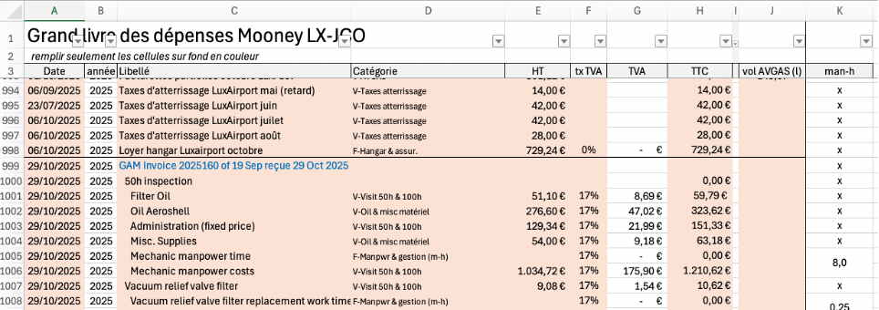
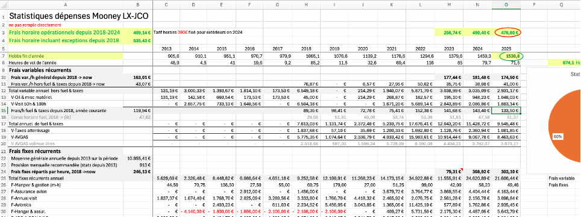
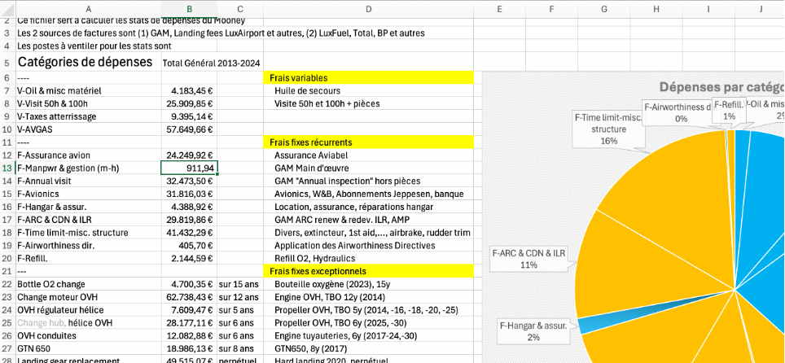

# Tutorial ChiquitaAI
*2026 January tutorial* 

Use free AI chatbots to build an Excel for Mac worksheet to manage sharing and owning a private plane.

# Coding Example using ChatGPT

Since 2022, when AI-powered chatbots started being very popular, I experimented how to use their free tier of service to describe Machu Picchu so that the chatbots can generate code for it. The purpose is to help humanitarians, without much coding experience, build state-of-the-art apps to support their daily work.

_In project Machu Picchu, we aim to use 21st century tools to change the way humanitarian aid is practiced._

This document is a step by step illustration of the chatbot-powered coding workflow. To make it easy to laypersons (non-programmers), instead of coding on JavaScript, Python or a programming language, in this example we develop acomplete Excel application using Excel best practices with the assistance of the free tier of ChatGPT, in Thinking mode when required.

# Overview of our purpose

## AI-powered Workflow in a Nutshell

- Step A: 1️⃣ describe what you want 2️⃣ have the bot criticize and suggest improvements 3️⃣ have it generate a detailed design. Reiterate once, to trap eventual hallucinations.
- Step B: start a new session, 1️⃣ paste the design, 2️⃣ have the AI chatbot generate the code, 3️⃣ have it criticize its code. Reiterate once, to trap eventual hallucinations.
- Step C: 1️⃣ run the AI-generated app, 2️⃣ handcraft add the desired features that are too business-specific to spend time explain to the chatbot, 3️⃣ start a new session , submit my code, ask for refactoring
- Loop to step B.

Hints:

- Instead of describing textually what you want, you make a quick prototype and give it to the chatbot to explore and comment.
- Often, irrelevant criticisms of the chatbot about your prototype announces future misunderstandings when asking it to generate code. Clarify these criticisms and start a new session.
- Start new session as often as practical, as soon as the chatbot has achieved a significant step. This will clean the context, focus the discussion and avoid hallucinations.

## Spoiler Results

Spoiler results list what we have learned from this tutorial if we don't have time to go into details:

- ChatGPT 5.2 hallucinates the least when the question is difficult and not widely known in public documents. For example, when on Excel for Mac a I use a LAMBDA function inside a MAP function to populate 2D array cells created with MAKEARRAY. Don't be scared by these names, I barely know them too before I started this project, but I learned how to use them with the chatbots.
- Gemini is the second best chatbot. Most of the time it gives pertinent advice. But in some implementation imperfections of Excel on Mac, it keeps reasoning around without reaching a solution. I use it as a cross-check of ChatGPT answer: I give it the code of ChatGPT and ask it to comment and improve.
- Claude Sonnet 4.5 is very popular among programmers but its free tier is not usable for our purposes. It is complicated to set up Claude to accept uploading of Excel files for it to analyze and criticize. In our workflow, to avoid making a long description of what we want to achieve, we start by making a prototype, that we upload to the chatbot and ask it to do better.
- Mistral, DeepSeek 3, Qwen 2 (in their free tiers) are truly not up to the task.

So we use ChatGPT 5.2 instead of other chatbots: in this particular case, ChatGPT free tier gave the most useful answers.

Keep in mind that a modern chatbot doesn't simply call on a LLM (Large Language Model) to generate answers. It is now a complex orchestrator of other tools than the LLM (path generator and evaluator, web crawler, adversarial challenger etc.) to find the best answer. Therefore, an outstanding LLM may perform poorly if it doesn't have well configured its environment of support tools.

_The situation of chatbots using LLMs is similar to engineering a car by starting with a powerful engine and then add supporting accessories to make it a comfortable limousine, or SUV, or a van. In our experience, Claude may be good for coding apps, but less effective to make a real-life Excel worksheet._

## What this article is made of

This article carries several types of content:
-	In a Medium article, a LinkedIn article, and a Github README.md file is hosted the textual explanation. It describes our purposes, the chatbot prompts and parts of the chatbot reply to introduce the next prompt. It contains also our comments on the bot replies.
-	The full chatbot answers and the generated codes are in github md files, repository tutorial_chiquitaAI.
-	The intermediate worksheets are also in the same github repository.

If you don't have time to look at details, you can stop reading here. If you continue, be prepared to reproduce by yourself the results with a free ChatGPT account and Excel 365.

# Full scale example: Excel Tool for Expenses Tracking

In this example of January 2026, I use ChatGPT 5.2 in Thinking mode. The 2 other chatbots that have this reasoning mode are : Google Gemini 3 and Claude 4.5.

I want to realize a cost analysis tracking tool for a private aircraft. This is not trivial example project and is composed of 3 sub-projects :

1.	Re-engineer the initial hack of a yearly expense tracking tool. This is the purpose of this post.

2.	After the AI-refactored tool is validated, add the operations costs (fuel, landing fees) to make it a flight billing and operations. This step involves understanding the nature of the activities and is where AI helps a lot because it converts the human language to computer processes.

3.	Re-engineer both the expense tracking, the flight billing and the refueling operations to make statistics and a KPI dashboard. This stage will only be sketched.

To start, I made a sample Excel worksheet to show what I want to do. Most of the formulas are hard coded cell by cell, which is a typical hack, made to describe and explore a solution. 

This tool has 3 Excel tabs:

- "Data": this table carries the bulk expenses data, each expense is assigned to a category

- "Stats": this table carries the yearly expenses per category. It distinguishes the fixed recurring expenses, the variable expenses, and for the exceptional high-value non-recurring expenses that are paid one year and amortized over several years.

- "KPI": this table specifies the categories of expenses. As a typical hack, it is a mix of read-only category labels with a textual explanation of each category and of formula cells that calculate the average expenses per year for each category as well as the maintenance performance (ratio of mechanics hours on flying hours).

# Session 1: Generate Detailed Design

## Prompt: Describe Data and Actions

I upload this example to Chat GPT (no Thinking, no Deep research) and asked (this prompt is also in the github as `promp_01.md`):

_Keep in mind for the whole session that you are a highly experienced Excel programmer, you use Excel 365 for Mac and although I'm familiar with Excel there are many advanced aspects I'm not too familiar with. You know that Power Pivot and Data Model are not implemented in Excel for Mac._

_Describe in detail the uploaded file so that you can use your description as requirements to create an Excel worksheet with the same functionalities but better engineered and using Excel best practices, with easy-to-understand variables and comments._

The answer of ChatGPT follows. This answer is also in the github as `answer_01.md`

## ChatGPT Describes Data and Actions ("No Thinking" mode)
The overall structure is correctly perceived.
- Overall Purpose of the Workbook
- Sheet: OLD-Data (Raw Data Layer)
- Sheet: OLD-Stats (Yearly Aggregation & Cost Model)
- Sheet: OLD-KPI (High-Level Indicators)
- Cross-Sheet Dependencies
- Target Architecture (Implicit Requirements

The overall purpose and the layers of sheets are identified. The major weaknesses of the implementation are listed.

Sheet "Data" is well identified as an "almost-Excel-table". Categories are wrongly qualified as "free-text": the data validation is not identified, certainly because we are in no-thinking mode. We have a target functional requirements for re-factoring.

Sheet "Stats" is well qualified as "a manual pivot table implemented with formulas", extremely layout-dependent, logic and presentation are tightly coupled. Old-style Excel calculations. Improvements are proposed to reduce the weakness of the programmation style.

Sheet "KPI"is weel perceived as "summarizing KPI" stats across years and very fragile dependent on years count.
Overall, the "no-thinking" mode notes the biggest flaws:  there is no abstraction layer and the same logic is duplicated, making the sheet very fragile to maintain. However, the Name Manager has not been examined, nor the data validation.

##	ChatGPT Describes Data and Actions ("Thinking" mode)

The answer of ChatGPT follows. This answer is also in the github as `answer_02.md`

# a